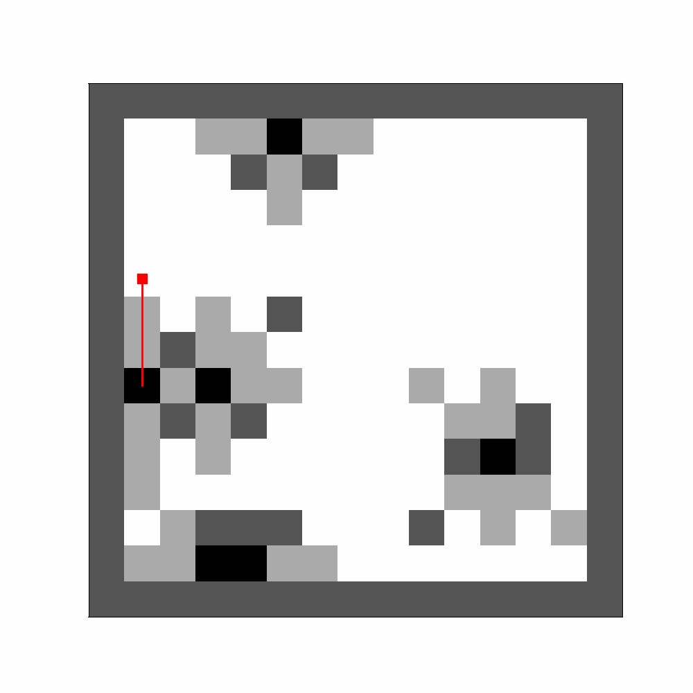
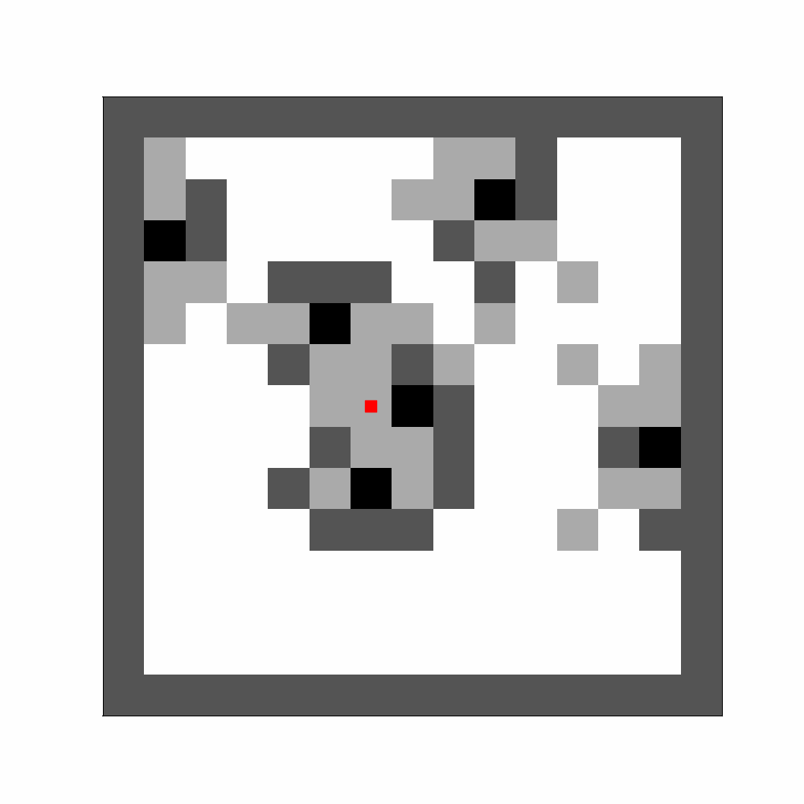
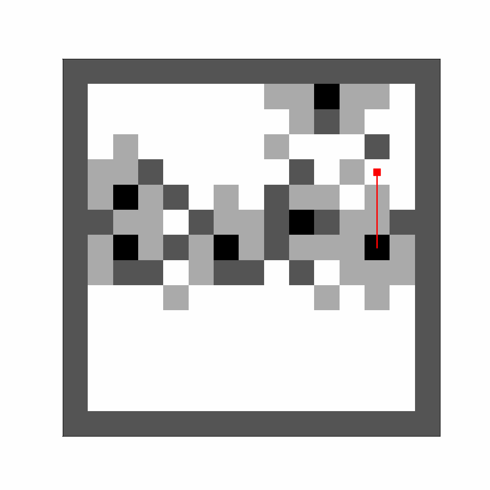
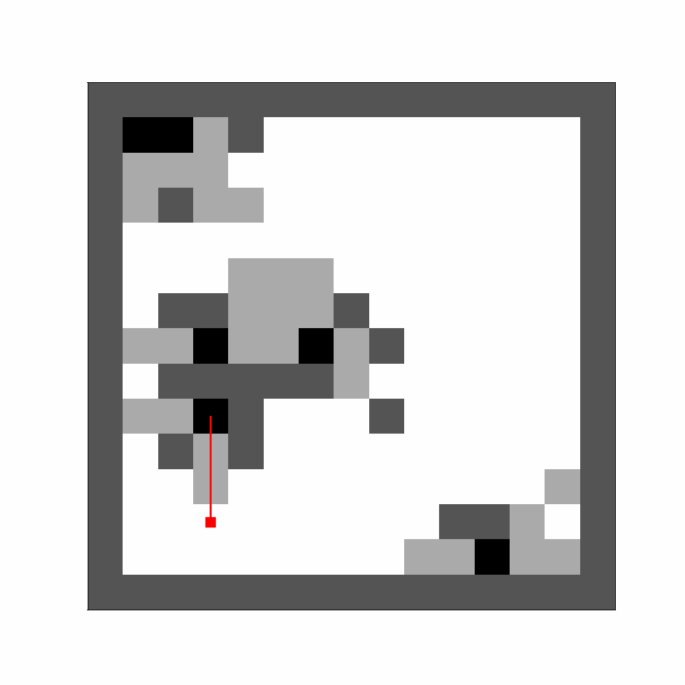
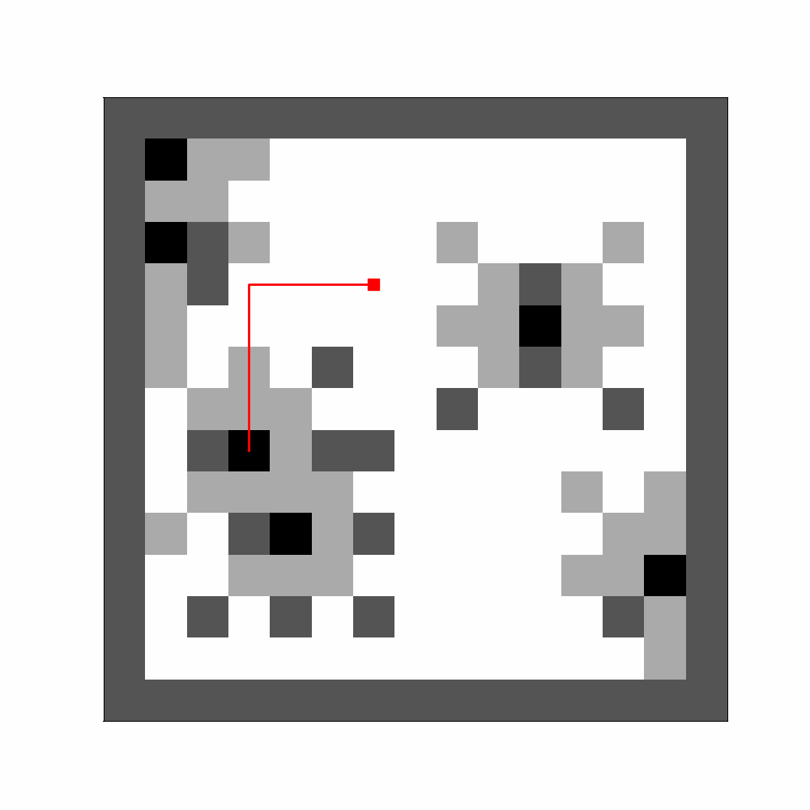
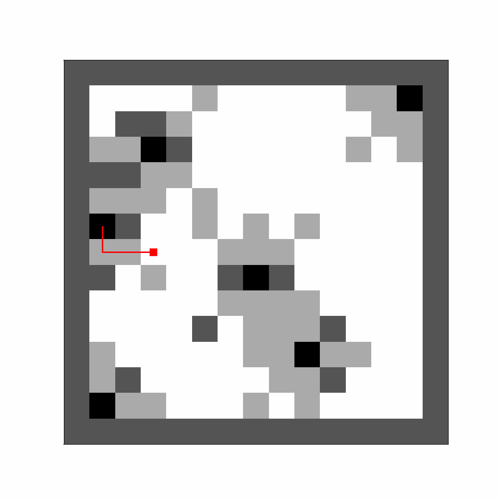
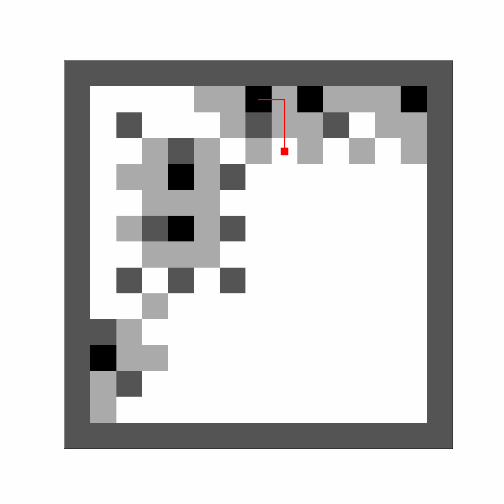

# Multi-Agent Maze Exploration Algorithms (BSc Thesis)

## Overview
This repository contains algorithms for maze exploration with multiple agents, developed for my BSc thesis. The algorithms are designed to efficiently navigate and explore maze environments using a swarm of agents.

## File Naming Convention
The resulting Excel files of the experiments (saved in the `results` folder) follow a specific naming convention to convey essential metadata. The `results` folder contains subfolders with names that correspond to the algorithm that made these results.

The file with all experiments is named like so:

```
{algo}_all_{rows}x{cols}_{coverage_mode}_{agent_view}.xlsx
```

The file with the averages of the experiments is named like so:

```
{algo}_{rows}x{cols}_{coverage_mode}_{agent_view}_{num_test}.xlsx
```

Each element in the title signifies:

- `algo`: the algorithm used for the maze coverage (nearest frontier, HEDAC, etc).
- `rows`: The number of rows in the maze represented in the Excel file.
- `cols`: The number of columns in the maze represented in the Excel file.
- `coverage_mode`: Indicates whether the goal was to explore the entire maze stage (True or False).
- `agent_view`: Represents the range of vision for each agent (typically set to 2 blocks).
- `num_test`: Applicable only in the files with the averages of the experiments, denoting the number of tests used for calculating the averages.

This naming convention provides a clear understanding of the contents and context of each Excel file generated by the algorithms. Also, if the Excel files start with `p_` that means that the experiments were run in parallel (using multiprocessing).

## Coverage Mode

This mode, extensively researched in my thesis and denoted by `coverage_mode = True` in the titles of the Excel files, aims to **thoroughly explore the entire stage**. 

The metrics used in the experiments are the ones denoted in paper *<u>Yan, Z., Fabresse, L., Laval, J., & Bouraqadi, N. (2015, September). Metrics for performance benchmarking of multi-robot exploration. In 2015 IEEE/RSJ International Conference on Intelligent Robots and Systems (IROS) (pp. 3407-3414). IEEE</u>*. For more information on how these are calculated, see paper or corresponding documentation in the code of this repo.

The columns in these files are structured as follows:

**In the File with All Experiments:**
- `#_Agents`: Number of agents used.
- `Coverage`: Coverage percentage of the maze.
- `Total_Rounds`: Total rounds for the experiment to finish (maze exploration or reaching dead ends).
- `Expl_Cost`: Cost of maze exploration for this test.
- `Expl_Eff`: Efficiency of maze exploration for this test.
- `Avg_Round_Time`: Average round time per test (in seconds).
- `Avg_Agent_Step_Time`: Average time taken by an agent to make a move per test (in seconds).
- `Experiment_Time`: Time (seconds) until agents have explored target percentage (e.g. 100%).
- `Obs_Prob`: Obs probability of the test.
- `Test`: Test index.

**In the Averages File:**
- `#_Agents`: Number of agents used.
- `Coverage`: Average coverage percentage of all experiments.
- `Avg_Total_Rounds`: Average total rounds of all experiments.
- `Avg_Expl_Cost`: Average cost of the exploration for all experiments.
- `Avg_Expl_Eff`: Average efficiency of the exploration for all experiments.
- `Std_Total_Rounds`: The standard deviation of rounds for all experiments.
- `Avg_Round_Time`: Average round time (in seconds) across all experiments.
- `Avg_Agent_Step_Time`: Average time taken by an agent to make a move (in seconds) across all experiments.
- `Experiment_Time`: Average time (seconds) across all experiments, until agents have explored target percentage (e.g. 100%).
- `Obs_Prob`: Obs probability of the test.

## Reach Goal Mode (not in thesis)

This mode was initially implemented during experimentation with various scenarios. Its objective is for the agents to reach a specified goal within the stage. Files associated with this mode are denoted by `coverage_mode = False` in their titles. The columns in these files are structured as follows:

**In the File with All Experiments:**
- `#_Agents`: Number of agents used.
- `Coverage`: Coverage percentage of the maze.
- `Total_Rounds`: Total rounds for the experiment to finish (maze exploration or reaching dead ends).
- `Avg_Rounds`: The average rounds it took for all agent to reach their goal (per test).
- `Avg_Round_Time`: Average round time per test (in seconds).
- `Finished_Agents`: The percentage of agents that reached their goal.
- `Avg_Agent_Step_Time`: Average time taken by an agent to make a move per test (in seconds).
- `Experiment_Time`: Time (seconds) until experiment completion.
- `Obs_Prob`: Obs probability of the test.
- `Test`: Test index.

**In the Averages File:**
- `#_Agents`: Number of agents used.
- `Coverage`: Average coverage percentage of all experiments.
- `Avg_Total_Rounds`: Average total rounds of all experiments.
- `Avg_Round_Time`: Average round time (in seconds) across all experiments.
- `Avg_Agent_Step_Time`: Average time taken by an agent to make a move (in seconds) across all experiments.
- `Experiment_Time`: Average time taken (in seconds) for experiment completion.
- `Obs_Prob`: Obs probability of the test.


<details closed>
<summary><h2>Maze Coverage Examples</h2>Here are the results from the algorithms used for maze coverage (click here to view):</summary>

### Nearest-Frontier:
<p align="center">
  
</p>

### HEDAC:
<p align="center">
  
</p>

### Flood Fill:
<p align="center">
  
</p>

### Cost Utility - MNM:
<p align="center">
  
</p>

### Cost Utility - JGR:
<p align="center">
  
</p>

### Cost Utility - BSO:
<p align="center">
  
</p>

### New CU Diffgoal Path:
<p align="center">
  
</p>

</details>